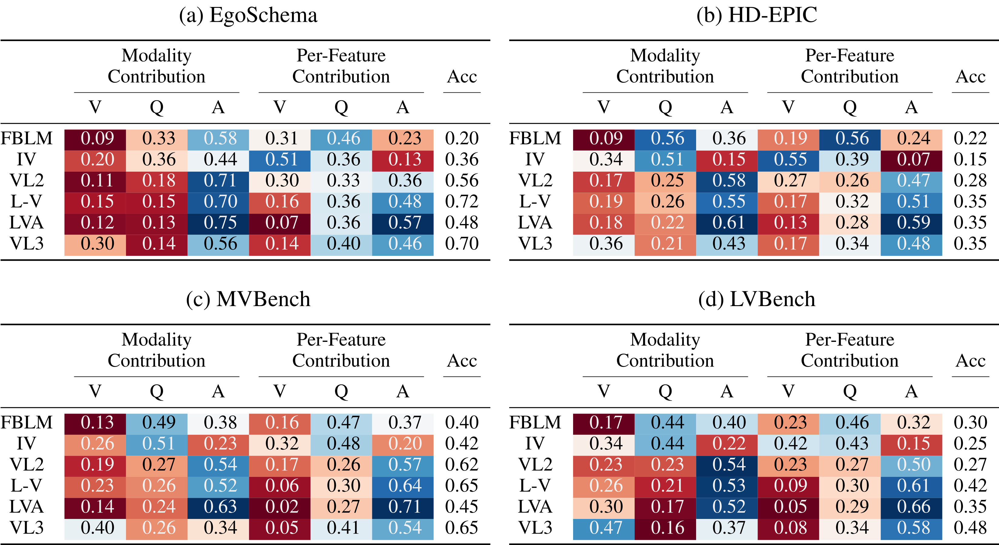

# [A Video Is Not Worth a Thousand Words](https://sjpollard.github.io/a-video-is-not-worth-a-thousand-words/)


[Sam Pollard](https://sjpollard.github.io), [Michael Wray](https://mwray.github.io)

## Overview

We investigate the integration of video into vision language models (VLMs) by calculating Shapley values of arbitrarily defined features for the multiple-choice visual question answering (VQA) problem. Using these Shapley values we categorise the features based on 3 input modalities (video, question and answer) then compute modality contribution metrics that demonstrate a lack of focus on video frames. These claims are backed up by experiments using modality and feature masking. As well as this, we demonstrate that merely adding more possible answer choices beyond the default 4-5 can increase video contribution without significantly altering the benchmark. Frame attributions generated by these models often do not correlate with common sense, so we also demonstrate that Gemini consistently disagrees with the output frame rankings. 

## Results



## Usage

### Implemented Models

If you want to calculate Shapley values for one of the models we've implemented for the paper (VideoLLaMA3 for example), simply run the following:

```
python run_videollama3_shap.py -d egoschema -f 180 -s subsets/egoschema.csv -n 5000 -c calculate
```

#### Useful Args

* `-d`/`--dataset`: VQA dataset to use
* `-f`/`--frames`: Number of frames to load
* `-s`/`--subset-path`: Path to subset CSV
* `-n`/`--iterations`: Number of iterations (forward passes) for the Shapley approximation
* `-c`/`--command`: Default operation is calculation of Shapley values but `benchmark` will run model inference with masking combinations

### General Case

If you want to apply this setup to a new model (let's say \<MODEL\>), you'll need to define a few custom functions:

* Copy [run_videollama3_shap.py](./run_videollama3_shap.py) or similar to a new file.

* Define a `prepare_<MODEL>` function that loads the model and any tokenisers/processors.

* Define a version of `apply_multi_modal_mask` that takes in the VQA-tuple and the flat boolean mask generated by the `shap` explainer, then masks out the corresponding features in the 3 modalities.

* In `<MODEL>_forward` make sure to query the VLM with this masked input and then extract the logits for the output token, returning the values for the classes of interest (usually tokens A-E). 

### Resulting Shapley values

Generated Shapley values are saved in [shap_results](./shap_results) in the following format:

| element |	A | B | C | D | E: Ground Truth |
| - | - | - | - | - | - |
| frame_0 |	-0.05 |	-0.01875 | -0.03125 | -0.003125 | -0.009375 |
| ... |	... | ... | ... | ... | ... |
| frame_n-1 |	0.003125 | 0.003125 | 0.009375 | 0.04375 | 0.003125 | 

Metrics for dataset subsets can be computed with the following command:

```
python run_shap_metrics.py --model videollama3 -d egoschema -s subsets/egoschema.csv -n 5000 -c metrics
```

## Install

### FrozenBiLM

* Download How2QA checkpoint from [here](https://drive.google.com/file/d/1mJnO2CUUuyfQ6ic2bU6PbuivmArvXAOT/view).

* Update the `<FROZENBILM-PATH>` placeholder to be the path to this checkpoint.

* Create environment:

```
conda create -n frozenbilm python=3.9
```

```
conda install -c conda-forge pytorch=2.4.1=*cu*
```

```
conda install --no-deps -c conda-forge torchvision=0.19.0
```

```
pip install -r frozenbilm/requirements.txt
```

```
pip install shap
```

* Run the feature generation notebooks in [this directory](./frozenbilm).

### InternVideo

* Download ViT checkpoint from [here](https://openaipublic.azureedge.net/clip/models/b8cca3fd41ae0c99ba7e8951adf17d267cdb84cd88be6f7c2e0eca1737a03836/ViT-L-14.pt).

* Download InternVideo checkpoint from [here](https://wenjuan.feishu.cn/m/res?t=syQjww7QWNJi-jk5u).

* Update the `<INTERNVIDEO-VIT-PATH>` placeholder to be the path to the ViT checkpoint.

* Update the `<INTERNVIDEO-PATH>` placeholder to be the path to the InternVideo checkpoint.

* Create environment:

```
conda create -n internvideo python=3.9
```

```
conda install -c conda-forge pytorch=2.4.1=*cu*
```

```
conda install --no-deps -c conda-forge torchvision=0.19.0
```

```
conda install --no-deps giflib
```

```
pip install -r internvideo/InternVideo1/Downstream/multi_modalities_downstream/requirement.txt
```

```
pip install timm==0.4.5 --no-deps
```

```
pip install scikit-learn
```

```
pip install shap
```

```
pip install decord
```

### VideoLLaMA2

* Create environment:

```
conda create -n videollama2 python=3.9
```

```
conda install -c conda-forge pytorch=2.5.1=*cu*
```

```
conda install --no-deps -c conda-forge torchvision=0.20.1
```

```
conda install --no-deps giflib
```

```
pip install -r videollama2/requirements.txt
```

```
conda install --no-deps -c conda-forge flash-attn=2.7.2
```

```
pip install timm==1.0.3 --no-deps
```

```
pip install shap
```

```
pip install decord
```

### LLaVA-Video

* Create environment:

```
conda create -n llava-video python=3.9
```

```
conda install -c conda-forge pytorch=2.5.1=*cu*
```

```
conda install --no-deps -c conda-forge torchvision=0.20.1
```

```
conda install --no-deps giflib
```

```
pip install -e "./llava_video/[train]"
```

```
conda install --no-deps -c conda-forge flash-attn=2.7.2
```

```
pip install shap
```

```
pip install decord
```

### LongVA

* Create environment:

```
conda create -n longva python=3.9
```

```
conda install -c conda-forge pytorch=2.5.1=*cu*
```

```
conda install --no-deps -c conda-forge torchvision=0.20.1
```

```
conda install --no-deps giflib
```

```
pip install -e "./longva/longva/[train]"
```

```
pip install -r longva/requirements.txt
```

```
conda install --no-deps -c conda-forge flash-attn=2.7.2
```

```
pip install shap
```

```
pip install decord
```

### VideoLLaMA3

* Download VideoLLaMA3 checkpoint from [here](https://huggingface.co/DAMO-NLP-SG/VideoLLaMA3-7B).

* Convert the checkpoint for local use with [convert_hf_checkpoint.py](./videollama3/scripts/convert_hf_checkpoint.py).

* Update the `<VIDEOLLAMA3-PATH>` placeholder to be the path to this checkpoint.

* Create environment:

```
conda create -n videollama3 python=3.9
```

```
conda install -c conda-forge pytorch=2.5.1=*cu*
```

```
conda install --no-deps -c conda-forge torchvision=0.20.1
```

```
conda install --no-deps giflib
```

```
pip install -r videollama3/requirements.txt
```

```
pip install timm==1.0.3 --no-deps
```

```
conda install --no-deps -c conda-forge flash-attn=2.7.2
```

```
pip install shap
```

```
pip install decord
```

### Gemini (for ranking)

* Create environment:

```
conda create -n gemini python=3.9
```

```
pip install -q -U google-genai
```

## Datasets

### EgoSchema

* Download the videos and annotations following [these](https://github.com/egoschema/EgoSchema) instructions (we used Kaggle and put the `subset_answers.json` file in the same directory). 

* Update the `<EGOSCHEMA-PATH>` placeholder to be the path to EgoSchema.

### HD-EPIC

* Clone the annotations repo from [here](https://github.com/hd-epic/hd-epic-annotations).

* Download the videos using [this](https://github.com/hd-epic/hd-epic-downloader).

* We then preprocessed the videos into 768x768 resolution at 1 FPS.

* Update the `<HD-EPIC-ANNOTATIONS-PATH>` placeholder to be the path to HD-EPIC's annotations.

* Update the `<HD-EPIC-VIDEO-PATH>` placeholder to be the path to HD-EPIC's videos.

### MVBench

* Download the videos and annotations from [here](https://huggingface.co/datasets/OpenGVLab/MVBench) (we do not use NTU RGB+D videos because we could not download them in a reasonable timeframe).

* You will need to check the contents of `data0613.zip` and move these videos into their corresponding datasets.

* Update the `<MVBENCH-PATH>` placeholder to be the path to MVBench.

### LVBench

* Download the dataset and annotations following these [instructions](https://github.com/zai-org/LVBench) (as with all YouTube datasets, some videos are now missing).

* Rename videos with `lvbench_utils.rename_videos`.

* Update the `<LVBENCH-PATH>` placeholder to be the path to LVBench.

## Acknowledgments

Our code is based upon the following prior works: [FrozenBiLM](https://github.com/antoyang/FrozenBiLM), [InternVideo](https://github.com/OpenGVLab/InternVideo), [VideoLLaMA2](https://github.com/DAMO-NLP-SG/VideoLLaMA2), [LLaVA-Video](https://github.com/LLaVA-VL/LLaVA-NeXT), [LongVA](https://github.com/EvolvingLMMs-Lab/LongVA), [VideoLLaMA3](https://github.com/DAMO-NLP-SG/VideoLLaMA3) and [shap](https://github.com/shap/shap).

## Citation

```
@article{DBLP:journals/corr/abs-2510.23253,
  author       = {Sam Pollard and
                  Michael Wray},
  title        = {A Video Is Not Worth a Thousand Words},
  journal      = {CoRR},
  volume       = {abs/2510.23253},
  year         = {2025}
}
```